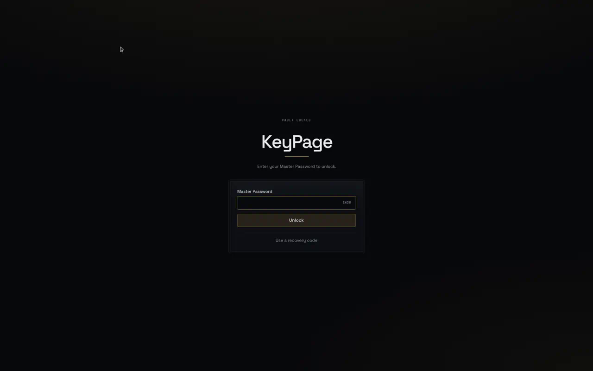
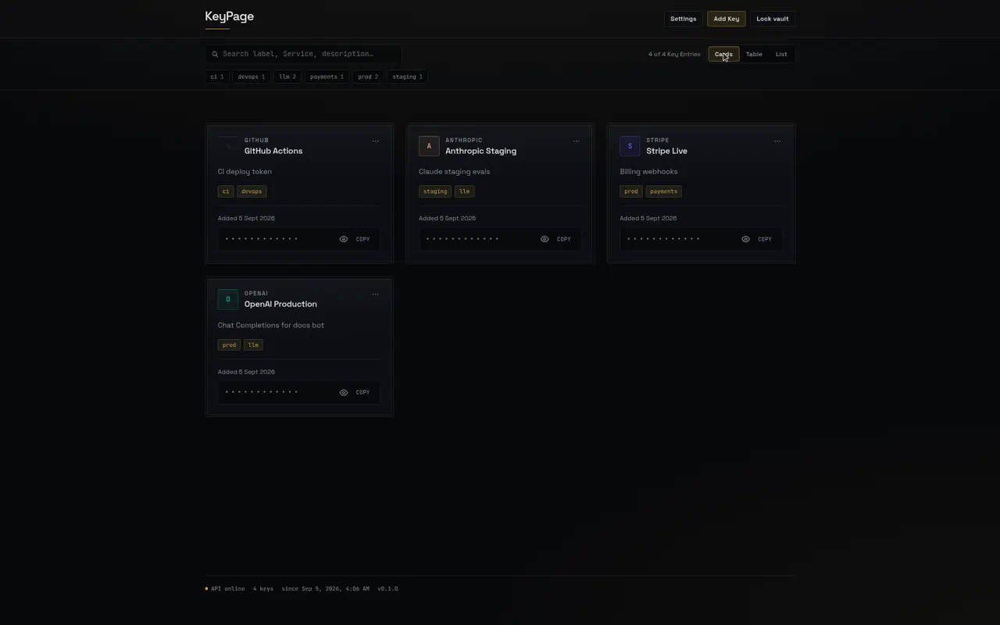
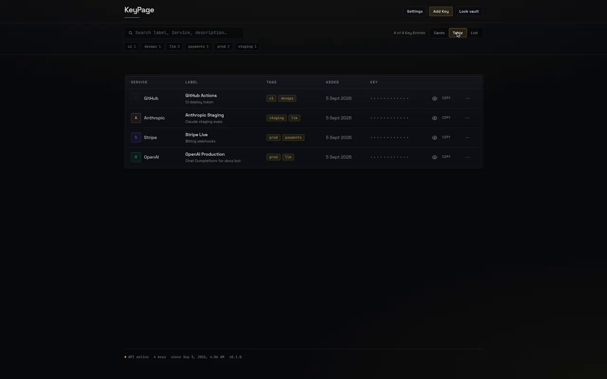
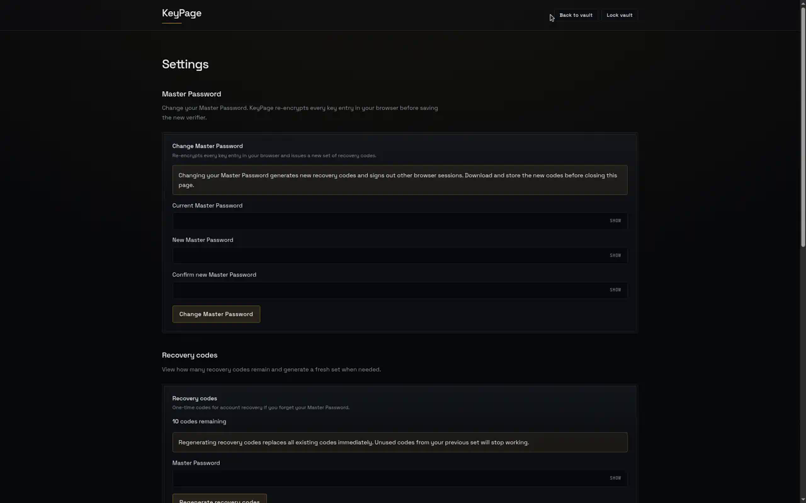

# KeyPage

Self-hosted, single-user API key vault.

## Status

**v1** — full self-hosting surface shipped ([SAA-113](https://linear.app/saadiqhorton/issue/SAA-113/spec-keypage-v1-self-hosted-api-key-vault)):

- Vault setup, unlock, recovery, and session lock
- Key Entry CRUD (add, edit, delete with confirmation)
- Dashboard views: Card Grid (default), Table, and List
- Search (label, Service, description) and tag filters
- Settings: change Master Password, recovery codes, session timeout, encrypted backup import/export

## What KeyPage does

- **Client-side encryption** — API keys are encrypted in the browser before they reach the server. The Master Password never leaves your browser.
- **Single-user vault** — one deployment, one person. Not a password manager; it stores third-party API keys and related metadata.
- **Dark-only, desktop-first UI** — polished on 1024px+ screens; mobile gets a basic stacked fallback.
- **SQLite on a bind mount** — all persistent state lives under `./data` on the host.
- **Docker on your LAN** — one container on port **9090**; reach it from other devices on your network.

## Screenshots

Unlock with your Master Password:



Card Grid dashboard (default view):



Table view with search and tag filters:



Settings — Master Password, recovery codes, session timeout, and encrypted backup:



## Requirements

The one-shot / Docker path needs **Git** and **Docker** (Compose v2) on the host — see [Quick start](#quick-start-docker).

Practical floor (not a hard guarantee): about **1 vCPU** and **~1 GB RAM** free for a comfortable VM (512 MB–1 GB for the container; 256 MB is too tight), plus a few hundred MB of disk for the image and `./data`.

Do **not** publish port `:9090` to the open internet. KeyPage does not terminate TLS. For remote access use a Tunnel or reverse proxy (HTTPS). First-boot setup over plain LAN HTTP exposes the setup POST body — see [First run](#first-run).

## Quick start (Docker)

One-shot install (clones into `~/keypage`, builds, and starts):

```bash
curl -fsSL https://raw.githubusercontent.com/saadiqhorton/KeyPage/main/scripts/install.sh | bash
```

Requires **Git** and **Docker** (Compose v2) on the host — not Node or pnpm. To update an existing install, use [Updates](#updates). Setup token after the one-line installer: `cat ~/keypage/data/setup-token` (or `cat ${KEYPAGE_DIR}/data/setup-token` if you overrode `KEYPAGE_DIR`).

Already have the repo checked out?

```bash
docker compose up -d --build
cat ./data/setup-token
```

Open [http://localhost:9090](http://localhost:9090) on the host, or `http://<LAN-IP>:9090` from another device on your network. The default listen port is **9090** (`DEFAULT_LISTEN_PORT` in `packages/shared`; override with `PORT`). Installer default directory: `~/keypage` (override with `KEYPAGE_DIR`).

### What `docker compose` does

| Piece | Detail |
|-------|--------|
| Image | Builds the `keypage` image from the repo `Dockerfile` (pinned `node:22-alpine` digest, API + built web UI) |
| Port | Maps host `9090` → container `9090` (same as `DEFAULT_LISTEN_PORT`) |
| Data | Bind-mounts `./data` → `/app/data` (SQLite and runtime state) |
| Restart | `unless-stopped` |
| Config | Optional `.env` at the repo root (see [Environment variables](#environment-variables)); compose loads it when present |

On first launch you are guided through vault setup. See [First run](#first-run).

### Logs, status, and health

```bash
docker compose logs -f keypage    # follow container logs
docker compose ps                 # running state
curl -sS http://127.0.0.1:9090/api/health   # {"status":"ok",...} when healthy
```

The image includes a Docker `HEALTHCHECK` that hits `/api/health` on `$PORT` inside the container (default **9090**).

## First run

1. **Get your setup token** — On first boot of an unclaimed vault, KeyPage writes a one-time setup token to the compose data dir (mode `0600`; installer default `~/keypage/data/setup-token`, or `$KEYPAGE_DIR/data/setup-token` if you overrode `KEYPAGE_DIR`). It is not printed to container logs. Retrieve it with:
   - One-line installer: `cat ~/keypage/data/setup-token`
   - Repo checkout / `docker compose` from the clone: `cat ./data/setup-token`
   - In-container (always the image path): `docker compose exec keypage cat /app/data/setup-token`
   The server binds `0.0.0.0` so anyone on your LAN or holding a Cloudflare Tunnel URL can reach the setup screen; the token is what stops them claiming your vault.
   **Transport:** the setup `POST` body (token plus first-boot secrets) rides the same connection you use. Plain LAN HTTP is visible to anyone who can observe that network. Prefer Cloudflare Tunnel or a reverse proxy with TLS **before** you claim the vault. The one-line installer still allows HTTP so `http://127.0.0.1:9090` works; set `KEYPAGE_REQUIRE_HTTPS_SETUP=true` to reject cleartext claims (and `KEYPAGE_TRUST_PROXY=true` if Tunnel/proxy terminates TLS in front of KeyPage).
2. **Setup** — Open the app. If the vault is new, you are redirected to `/setup`. Paste the setup token and choose a Master Password (minimum 12 characters). KeyPage derives your encryption key in the browser and sends only a login verifier to the server.
3. **Recovery codes** — After setup, 10 one-time recovery codes are shown and a `keypage-recovery-codes-*.txt` file downloads automatically. Save this file offline before continuing. Any single unused code can reset your Master Password later.
4. **Unlock** — After a page reload (or when the vault locks from inactivity), enter your Master Password on `/unlock` to decrypt keys in the browser. A valid session cookie alone does not unlock the vault - the encryption key lives only in memory until you log in again.
5. **Dashboard** — Add Key Entries (label, Service, description, tags, key value). Switch between Card Grid, Table, and List views. Search and filter by tags. Keys are masked by default; use reveal and copy (clipboard auto-clears after a timeout; requires HTTPS or localhost — LAN HTTP Copy fails closed).
6. **Settings** — Change Master Password (re-encrypts all entries client-side), view or regenerate recovery codes, adjust session inactivity timeout (15/20/25/30 minutes), and export or import an encrypted backup file.

To start over with a fresh vault (destroys all stored data):

```bash
docker compose down && rm -f data/keypage.db* data/setup-token
```

For local development without Docker, delete `data/keypage.db`, `data/keypage.db-wal`, `data/keypage.db-shm`, and `data/setup-token` instead.

**Lost the setup token?** Stop the app, delete `data/setup-token`, and start it again — a new token is minted into that file. Only possible with host access, which is the point.

## Data persistence and the `./data` volume

SQLite and all runtime state live under **`./data`** at the repository root. Docker maps it to `/app/data` inside the container. The directory is created on first run.

| File / path | Purpose |
|-------------|---------|
| `keypage.db` | Main SQLite database (encrypted key blobs, metadata, sessions, settings) |
| `keypage.db-wal`, `keypage.db-shm` | SQLite WAL sidecar files (present while the DB is open) |
| `setup-token` | First-boot setup token (mode `0600`); deleted once the vault is claimed |

The `data/` directory is listed in `.gitignore` - never commit your vault.

### Permissions (UID 1000)

The container runs as the `node` user (UID **1000**). The entrypoint ensures `/app/data` is owned by that user. If you see permission errors writing to `./data` on the host:

```bash
sudo chown -R 1000:1000 ./data
```

### Backups

- **Volume copy** — Stop the container (or copy while running at your own risk) and back up the entire `./data` directory. Restoring is the reverse: place files back and start the container.
- **Encrypted export** — In Settings, export a `keypage-backup` JSON file encrypted with your Master Password. Safer for off-box storage; use Import on another instance or after a fresh install to merge entries. Import only accepts files exported by KeyPage with unmodified KDF settings.

### Updates

From an existing Docker / one-line install (`~/keypage` by default), including checkouts created before `scripts/update.sh` existed:

```bash
curl -fsSL https://raw.githubusercontent.com/saadiqhorton/KeyPage/main/scripts/update.sh | bash
```

That one command fetches the updater from `main`, advances the checkout (default branch `main`), rebuilds the image, and recreates the container. Tracked local edits are reset onto `origin/main`. Untracked `./data` (vault / SQLite / setup-token) and your `.env` listen port stay in place.

Once the checkout has the script:

```bash
cd ~/keypage && bash scripts/update.sh
```

The updater fetches `KEYPAGE_REF` (default `main`) and hard-resets tracked files to that tip — including depth-1 one-line installs, which cannot `pull --ff-only`. Untracked `./data` is left alone. If origin is not the KeyPage repo, fetch fails, or vault files are tracked in git, it exits before rebuild. Vault files are not deleted.

If `/api/health` does not come back, the script exits non-zero and prints how to read `docker compose logs`. Vault files are not deleted.

If you terminate TLS elsewhere (reverse proxy or a personal Tunnel), update the container this way; keep targeting the same host port. Expect brief downtime while the container restarts.

Compose-only equivalent: `docker compose up -d --build` also keeps the `./data` bind mount. Your vault survives image and container updates as long as you do not delete `./data`.

The `Dockerfile` pins `node:22-alpine` by digest (`node:22-alpine@sha256:…`) so rebuilds stay on the same Node/Alpine. To take a newer official image on purpose:

```bash
docker buildx imagetools inspect node:22-alpine --format '{{json .Manifest.Digest}}'
```

Replace both `FROM node:22-alpine@sha256:…` lines (`AS base` and `AS runtime`) with that digest. Keep the slim runtime (`pnpm deploy` + a fresh alpine stage) — do not switch runtime back to `FROM build`.

## Secure context (Web Crypto vs fallback)

`crypto.subtle` (Web Crypto) is only available in a **secure context**. Use `http://localhost:9090` on the same machine, or HTTPS via a reverse proxy if you expose the app beyond localhost.

Plain HTTP to a LAN IP (e.g. `http://192.168.1.x:9090`) is **not** a secure context. KeyPage automatically falls back to a JavaScript crypto backend (`@noble/*`) so setup and login still work; vaults created in either mode remain compatible.

If you put KeyPage behind a reverse proxy that rewrites `Host` or terminates TLS, set `KEYPAGE_TRUST_PROXY=true` so session cookies, CSRF origin checks, and the optional HTTPS setup guard follow the forwarded headers.

## Environment variables

Copy `.env.example` to `.env` and adjust as needed. Compose loads `.env` when present (`required: false`).

| Variable | Default | Description |
|----------|---------|-------------|
| `PORT` | `9090` (`DEFAULT_LISTEN_PORT`) | HTTP listen port |
| `HOST` | `0.0.0.0` (`DEFAULT_LISTEN_HOST`) | Bind address |
| `KEYPAGE_DATA_DIR` | `./data` (local); `/app/data` (Docker image) | Persistent data directory (SQLite, etc.) |
| `KEYPAGE_WEB_DIR` | `apps/web/dist` (relative to API package); `/app/apps/web/dist` (Docker image) | Path to the built web UI served as static files |
| `LOG_LEVEL` | `info` | Fastify log level |
| `KEYPAGE_TRUST_PROXY` | `false` | Set to `true` behind a reverse proxy that sets `X-Forwarded-Proto` / `X-Forwarded-Host` |
| `KEYPAGE_REQUIRE_HTTPS_SETUP` | `false` | When `true`, reject `POST /setup` over clear HTTP. Accepts real TLS or `X-Forwarded-Proto: https` (only if `KEYPAGE_TRUST_PROXY=true`). Default stays off so the one-line installer can claim the vault on LAN HTTP |
| `KEYPAGE_SESSION_IDLE_MINUTES` | *(unset)* | Lock the vault after this many minutes without activity (valid range 15–30; Settings options are 15, 20, 25, 30). When set, pins the timeout: the Settings control becomes read-only and `PATCH /api/settings` is rejected. Leave unset to manage timeout from Settings |
| `KEYPAGE_SESSION_ABSOLUTE_HOURS` | `12` | Maximum session lifetime regardless of activity |
| `KEYPAGE_CLIPBOARD_CLEAR_SECONDS` | `30` | Seconds before copied key material is cleared from the clipboard (valid range 5–300) |
| `KEYPAGE_LOGIN_MAX_ATTEMPTS` | `5` | Failed login or recovery attempts before a temporary lockout |
| `KEYPAGE_LOGIN_LOCKOUT_MINUTES` | `5` | Duration of login/recovery lockout after max failed attempts |
| `KEYPAGE_LOGIN_FAILURE_WINDOW_SECONDS` | `900` | Sliding window for counting failed login/recovery attempts |

## Local development

```bash
pnpm install
pnpm dev
```

`pnpm dev` runs Turbo in parallel: Vite on the web app, `tsx watch` on the API. The API listens on port **9090**.

```bash
pnpm typecheck   # TypeScript across the monorepo
pnpm test        # API unit tests
```

## Production without Docker

```bash
pnpm build
KEYPAGE_WEB_DIR=apps/web/dist pnpm start
```

Listens on port **9090** by default. Set `KEYPAGE_DATA_DIR` if you want data outside `./data`.

## Project layout

| Path | Role |
|------|------|
| `apps/web` | React + Vite + Tailwind UI |
| `apps/api` | Fastify server (API + static web) |
| `packages/shared` | Shared types, Service Catalog, constants |

See [CONTEXT.md](CONTEXT.md) for product scope, security model, and glossary.

## What's not here yet

Not implemented in v1:

- Provider integrations (automatic key refresh/rotation)
- Activity log UI (events are stored server-side; no history screen)
- Polished mobile UX
- Light theme
- Multi-user accounts
